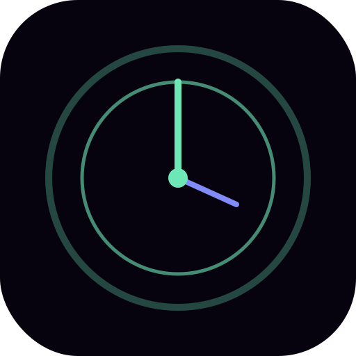

<div align="center">

# Session Clock



**The most complete focus timer on the open web.**

[](https://github.com/ADJ189/Accurate-Time-/actions)
[](https://www.typescriptlang.org/)
[](package.json)
[](public/manifest.json)
[](https://github.com/ADJ189/Accurate-Time-/security)

[**Live App →**](https://ADJ189.github.io/Accurate-Time-)&nbsp;&nbsp;·&nbsp;&nbsp;[Report Bug](https://github.com/ADJ189/Accurate-Time-/issues)&nbsp;&nbsp;·&nbsp;&nbsp;[Request Feature](https://github.com/ADJ189/Accurate-Time-/issues)

</div>

---

## What it is

Session Clock is a focus timer built with the philosophy that **the environment you work in shapes the quality of your work**. Every theme is a complete cinematic experience. Every feature earns its place.

| | |
|---|---|
| **Clock accuracy** | NTP-synced via Cloudflare probes, ±ms precision |
| **Themes** | 45 animated themes across 5 categories |
| **Audio** | 6 ambient tracks + binaural beats + true ILD/ITD spatial audio |
| **Intelligence** | Streak tracking, velocity score, peak-hour analysis, flow state detection |
| **Integrations** | Spotify, Google Calendar, Notion, Todoist, Linear, GitHub |
| **Languages** | 8 (EN, ES, FR, DE, JA, KO, PT, HI) |
| **Privacy** | Zero backend · Everything in `localStorage` · No tracking |
| **Install** | PWA — works offline, installable on desktop and mobile |

---

## Themes

### Natural
Aurora · Sunrise · Forest · Ocean · Candy · Nordic · Midnight *(+ shooting stars)* · Lemon · Blueprint · Living *(Conway's Game of Life)* · Common Room · SMPTE Timeline · Air-Gapped Terminal · Literary Clock

### TV Shows
Severance · Mr. Robot · House of the Dragon · Moon Knight · Supernatural · The Mentalist · The Sopranos · Dark · Breaking Bad · Stranger Things

### Movies
Cyberpunk 2077 · 2001: A Space Odyssey · Tenet · Interstellar *(+ wormhole)* · Oppenheimer · Dune · The Matrix · Blade Runner 2049 · Inception · The Godfather

### Anime ⛩
One Piece · Attack on Titan · Death Note

### F1 Teams
Red Bull Racing · Scuderia Ferrari · Mercedes-AMG · McLaren · Aston Martin

### Secret & Unlockable
🎮 **8-BIT** — Konami Code `↑↑↓↓←→←→BA`  
🔥 **Phoenix** — Complete 100 sessions  
🍳 **The Bear** — Type `thebear`

---

## Easter Eggs

<details>
<summary>Reveal all secrets (spoilers)</summary>

| Trigger | Effect |
|---|---|
| `↑↑↓↓←→←→BA` | Konami Code → 8-BIT theme, chiptune chime |
| Type `matrix` | Full-screen green rain cascade (5 seconds) |
| Type `inception` | UI spins 360° |
| Type `heisenberg` | Breaking Bad + "You're goddamn right" |
| Type `hal` or `daisy` | HAL 9000 dialogue overlay; `daisy` sings the song line-by-line |
| Type `tenet` | Clock reverses + UI hue-inverts for 5 seconds |
| Type `dracarys` / `targaryen` | House of the Dragon |
| Type `luffy` / `onepiece` | One Piece + gold screen flash |
| Type `lightyagami` | L analyses your actual session stats live |
| Type `potato chip` | "I'll take a potato chip… and eat it!" |
| Triple-click the clock | Dev console: FPS, tier, audio nodes, storage size |
| Hold session timer 3 seconds | Hyperfocus mode — UI disappears, Esc to exit |
| At exactly 00:00:00 midnight | Confetti burst |
| Shake your phone | Random theme shuffle |
| Click UTC pill 7× | Switches to Local Sidereal Time 🔭 |
| Complete 100 sessions | Phoenix theme unlocks |

Find more via the command palette: **`Ctrl+K`** → type `/`

</details>

---

## Keyboard Shortcuts

| Key | Action |
|---|---|
| `Space` | Start / Pause |
| `R` | Reset timer |
| `T` | Next theme |
| `Ctrl+K` / `Cmd+K` | **Command palette** — search everything |
| `/` | Command palette filtered to easter eggs |
| `F` | Fullscreen / Kiosk |
| `P` | Toggle Pomodoro |
| `M` | Sound mixer |
| `L` | Focus log |
| `?` | All shortcuts |
| `Esc` | Close / Exit Hyperfocus |

---

## Integrations

All integrations are **opt-in**, **local-only** (tokens stored in `localStorage`, never sent to any server), and **disconnectable** at any time.

Access via **Settings → Integrations** or `Ctrl+K → integrations`.

| Service | What it shows |
|---|---|
| **Spotify** | Now-playing, playback controls, focus playlist launcher (PKCE auth, no server) |
| **Google Calendar** | Upcoming events for the next 7 days (requires free API key) |
| **Notion** | Tasks from a connected database (requires integration token) |
| **Todoist** | Today's + overdue tasks with one-tap completion |
| **Linear** | Assigned open issues and PRs |
| **GitHub** | Assigned issues and open PRs |

---

## Features Deep-Dive

### Session Intelligence
- **Streak** — daily streaks with milestone toasts (3, 7, 14, 21, 30, 60, 90, 365 days)  
- **Velocity Score** — 0–100 focus quality derived from completed vs abandoned ratio  
- **Peak Hours** — surfaces your best focus hour after 5+ sessions  
- **Flow State** — 25 uninterrupted minutes triggers UI simplification + badge  
- **Smart Break Reminder** — amber pulse after 90 min without a break  

### Clock Modes
Digital · Analogue *(sweep hands)* · Flip *(3D card)* · Word · Minimal *(hour-only, huge)* · 7-Segment LED

### Clock Positions
**Top** — classic layout. **Centre** — clock fills the full viewport, panel slides up as a pull-tab.

### Pomodoro & Templates
- Configurable work / break / long-break durations  
- 8 session templates: Deep Work · Study · Coding Sprint · Writing Flow · Reading · Creative · Workout · Quick Sprint  
- Animedoro: 50 min focus / 20 min cinematic theater break  
- Box breathing guide on every break  

### Audio System
- 6 synthesised ambient tracks — Rain · Brown Noise · Forest · Café · Ocean · Fireplace  
- Binaural beats: Gamma 40Hz · Beta 18Hz · Alpha 10Hz · Theta 6Hz · Delta 2Hz  
- **True spatial audio** — ILD (level) + ITD (timing, 0.65 ms max) per-track spatial profiles  
- Saveable mixer presets  
- `MediaSession` API — lock-screen controls, headphone buttons  

### Session Completion
- 5-point quality rating after every session  
- Break activity suggestions (short and long pools)  
- Distraction counter — log interruptions during sessions  

### Focus Widgets
- **Deadline Countdown** — count down to any date/time, shown in UTC pill  
- **World Clock** — up to 5 timezones with live updates  
- **Session Templates** — apply preset duration, sound, and theme in one tap  

### Sharing & Export
- 1200×630 PNG focus card (native share sheet on mobile)  
- QR Handoff — pure TypeScript QR code to resume on another device  
- CSV export of session history  
- GitHub-style heatmap in the focus log  

### OS & Platform
- **PWA** — installable, works offline  
- **Picture-in-Picture** — Document PiP (Chromium) or Canvas PiP fallback  
- **Notifications** — Pomodoro phase changes via OS  
- **Wake Lock** — keeps screen on during sessions  
- **Cross-tab sync** — BroadcastChannel keeps all open tabs in sync  

### Privacy & Data
- Zero backend, zero accounts, zero tracking  
- Privacy Mode — disables weather, NTP sync, and Google Fonts  
- Incognito Sessions — nothing written to storage  
- Auto-Clear on Close  
- Full data export as JSON  

### Accessibility & Performance
- `prefers-reduced-motion` respected + manual toggle  
- Adaptive quality tiers (LOW / MED / HIGH) — auto-detects device  
- OffscreenCanvas bg caching — base gradient painted once, composited each frame  
- `Float32Array` particle pools — no GC pressure  
- Auto-degrades on low FPS or low battery  
- Tab hidden → canvas render fully paused  

---

## Architecture

```
src/
├── main.ts          App orchestration, render loop, all UI
├── renderer.ts      Canvas engine: 45 themes, transitions, parallax, OffscreenCanvas cache
├── themes.ts        45 typed theme definitions
├── easter.ts        16 easter eggs — Konami, keywords, midnight, shake, hyperfocus
├── features.ts      Status line, templates, rating, onboarding, countdown, world clock
├── integrations.ts  Spotify (PKCE), Google Calendar, Notion, Todoist, Linear, GitHub
├── i18n.ts          8-language string system (EN/ES/FR/DE/JA/KO/PT/HI)
├── cmdpalette.ts    Command palette — 90+ searchable items, fuzzy match
├── intelligence.ts  Streak, velocity, peak hours, flow state
├── apis.ts          Notifications, MediaSession, Wake Lock, PiP, Share, Battery
├── privacy.ts       Data management, incognito, auto-clear, export
├── perf.ts          Adaptive quality tier, FPS tracker, OffscreenCanvas, visibility
├── sound.ts         Web Audio: 6 tracks + binaural + ILD/ITD spatial
├── share.ts         1200×630 PNG focus card generator
├── shop.ts          Token economy (opt-in via Settings → Display)
├── focuslog.ts      Session log, heatmap, CSV export
├── pomodoro.ts      Pomodoro phases, SVG ring, templates
├── weather.ts       Open-Meteo + NOAA solar calculation
├── timesync.ts      Cloudflare NTP + WorldTimeAPI fallback
├── qr.ts            GF(256) Reed-Solomon QR encoder (pure TS)
├── litclock.ts      288 literary quotes for Literary Clock
├── utils.ts         Shared helpers
└── types.ts         TypeScript interfaces
```

### Tech Stack

| Layer | Technology |
|---|---|
| Language | TypeScript 5 strict mode |
| Build | Vite 5 + Terser (toplevel mangle, console drop) |
| Canvas | HTML5 2D Canvas — OffscreenCanvas bg cache, Float32Array pools |
| Audio | Web Audio API — zero audio files; true ILD+ITD spatial |
| Time | Cloudflare multi-probe NTP + WorldTimeAPI fallback |
| Weather | Open-Meteo (free, no key) |
| Solar | NOAA Spencer / hour-angle formula, local computation |
| QR | Custom GF(256) Reed-Solomon, Version 2-M, pure TypeScript |
| Integrations | Spotify PKCE, Google Calendar v3, Notion v1, Todoist v2, Linear GraphQL, GitHub v3 |
| Cross-tab | BroadcastChannel API |
| PWA | Web App Manifest + Service Worker |
| Storage | `localStorage` only — no backend, no cookies, no analytics |
| Deploy | GitHub Actions → GitHub Pages |

---

## Getting Started

```bash
git clone https://github.com/ADJ189/Accurate-Time-
cd Accurate-Time-
npm install
npm run dev        # localhost:5173
```

```bash
npm run typecheck  # zero-error TypeScript check
npm run build      # production build → dist/
npm run preview    # preview production build
```

### Deploy to GitHub Pages

1. Push to `main`
2. **Settings → Pages → Source → GitHub Actions**

The included `.github/workflows/deploy.yml` runs `typecheck → build → deploy` on every push. Zero configuration needed.

---

## Security

Session Clock is **CodeQL-verified** — zero `innerHTML` injection of user-supplied data across 24 TypeScript modules. All dynamic content uses `textContent`, developer-authored SVG constants, or Canvas rendering.

[](https://github.com/ADJ189/Accurate-Time-/security/code-scanning)

---

## License

MIT — use it, fork it, ship it.

---

<div align="center">
<sub>24 TypeScript modules · Zero runtime dependencies · 45 themes · 16 easter eggs · 6 integrations · 8 languages</sub>
</div>
